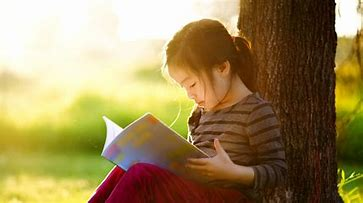

## READING HABIT

### One of the best habits....

## Different-Different Materials to read

1. Books
2. Newspapers
3. Social Media 
4. Magazines

|**Books** | **Newspapers** | **Social Media** | __Magazines__ |
|-------|------------|--------------|----------|
|Spiritual Books | Tribune | Facebook |  Celebrity magazines |
|Course Books | Denik Svera | Instagram | General News Magazines |
| Science | Denik jagran | Twitter | Sports magazines | 

## Advantages 

- Stress Reduction
- Knowledge
- Mental Stimulation
- Vocabulary Expansion
- Memory Improvement
- Stronger Analytical Thinking Skills
- Improved Focus and Concentration
